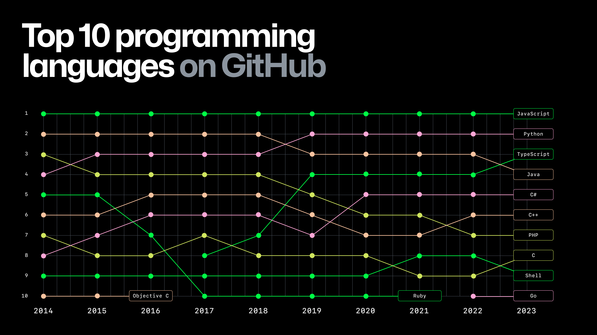

# Python como lenguaje de programación en Data

Python es un lenguaje de programación versátil y poderoso, conocido por su simplicidad y legibilidad. Es un lenguaje orientado a objetos, lo que significa que permite a los desarrolladores construir programas organizados y reutilizables a través de la encapsulación de datos y comportamiento en objetos. Además, Python se destaca por su amplia aplicabilidad en diversas disciplinas, incluyendo el desarrollo web, la automatización, la inteligencia artificial, y, de manera destacada, la ciencia de datos.

### Qué es un objeto?

> Un objeto es la representación computacional de una entidad de la vida real.

### Diferencias con R

R, por el otro lado, es un lenguaje de programación orientado a funciones.

```r
head(df)
```

```python
df.head()
```

## Python como principal lenguaje en ciencia de datos

Python ha sido considerado el lenguaje más popular en la ciencia de datos durante varios años consecutivos. Según la [encuesta anual de desarrolladores de Stack Overflow](https://survey.stackoverflow.co/2023/#overview), Python ha mantenido su posición como el lenguaje más utilizado por científicos de datos y analistas. Esto se debe en gran parte a la rica colección de bibliotecas disponibles, como Pandas para la manipulación de datos, Matplotlib y Seaborn para visualización, y scikit-learn para machine learning. Además, su curva de aprendizaje relativamente suave lo hace accesible tanto para principiantes como para profesionales experimentados.


## Python como principal lenguaje en ingeniería de datos

La ingeniería de datos se ha convertido en una disciplina crítica en el manejo de grandes volúmenes de información. Python, con sus bibliotecas como Apache Spark, Dask, y PySpark, ha emergido como el lenguaje de elección en este campo. Un estudio realizado por [Data Engineering Weekly](https://www.dataengineeringweekly.com/) muestra que Python es uno de los lenguajes más utilizados por los ingenieros de datos debido a su capacidad para manejar y procesar grandes volúmenes de datos de manera eficiente y su integración con plataformas de big data como Hadoop y Spark. Además, el uso de Python en ingeniería de datos sigue creciendo debido a la facilidad con la que se puede integrar con herramientas de orquestación como Apache Airflow.


## Python como principal lenguaje en IA

En el campo de la inteligencia artificial (IA), Python también ocupa un lugar destacado. La facilidad con la que se pueden construir y entrenar modelos de aprendizaje profundo ha hecho de Python el lenguaje preferido para desarrolladores e investigadores. Herramientas como TensorFlow, PyTorch y Keras han sido fundamentales en la adopción de Python en IA. [Un informe de GitHub](https://github.blog/news-insights/research/the-state-of-open-source-and-ai/) muestra que Python es el lenguaje más popular en proyectos relacionados con IA, superando a lenguajes como R y Java en términos de número de repositorios y contribuciones.



## Python para gaming

Aunque no es tan comúnmente asociado con el desarrollo de [videojuegos](https://realpython.com/top-python-game-engines/) como lenguajes como C++ o C#, Python también juega un papel en esta industria. Motores de juego como Pygame y Panda3D permiten a los desarrolladores crear prototipos de juegos de manera rápida y sencilla. Python es especialmente popular en el desarrollo de juegos independientes y educativos, donde la simplicidad del lenguaje permite a los desarrolladores concentrarse más en el diseño y la jugabilidad que en la complejidad del código.

## Python para desarrollo web

Python también ha dejado su marca en el desarrollo web, gracias a frameworks como Django y Flask. Django es un framework de alto nivel que permite el desarrollo rápido de sitios web seguros y mantenibles, mientras que Flask es una opción más ligera que ofrece flexibilidad para proyectos más personalizados. [Un estudio de JetBrains](https://www.jetbrains.com/lp/devecosystem-2023/) indica que Python es uno de los lenguajes más populares para el desarrollo backend, superando a PHP y Ruby, y solo superado por JavaScript.

