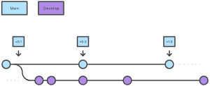
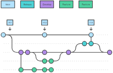

# Capítulo 2: Qué es un repositorio de código y un entorno virtual

En este capítulo, exploraremos los conceptos fundamentales de un repositorio de código y el uso de entornos virtuales en Python. Entender cómo gestionar el código y mantener un entorno controlado es esencial para cualquier proyecto de desarrollo, y también en ciencia de datos.

## 1. Qué es un repositorio de código

Un repositorio de código es un lugar donde se almacena el código fuente de un proyecto. Los repositorios permiten a los desarrolladores organizar, gestionar, y compartir su código de manera efectiva. Son fundamentales para el desarrollo colaborativo, ya que facilitan la coordinación entre múltiples desarrolladores trabajando en el mismo proyecto. Un repositorio de código puede estar alojado localmente en tu computadora o en una plataforma en la nube, como GitHub.

Los repositorios no solo almacenan el código, sino también el historial de cambios, lo que permite rastrear quién hizo qué cambio y cuándo. Esto es crucial para mantener la integridad del proyecto y para la resolución de conflictos cuando múltiples desarrolladores contribuyen simultáneamente.

## 2. Qué es Git

Git es un sistema de control de versiones distribuido que permite a los desarrolladores rastrear los cambios en el código a lo largo del tiempo. Creado por Linus Torvalds en 2005, Git es una herramienta esencial para el desarrollo de software moderno. Con Git, es posible crear múltiples versiones de un proyecto, trabajar en diferentes ramas de desarrollo, y fusionar cambios de manera segura.

Git permite un flujo de trabajo no lineal, lo que significa que varios desarrolladores pueden trabajar en diferentes partes del código simultáneamente, sin interferir entre sí. Además, Git permite revertir cambios, restaurar versiones anteriores, y crear ramas para probar nuevas características sin afectar el código principal.

## 3. Por qué usar Git para desarrollo

El uso de Git para el desarrollo tiene numerosos beneficios:

- **Colaboración:** Git facilita el trabajo en equipo, permitiendo que múltiples desarrolladores trabajen en el mismo proyecto sin sobrescribir el trabajo de otros.
- **Control de versiones:** Con Git, puedes rastrear cada cambio hecho en el código, quién lo hizo, y cuándo se hizo, lo que facilita la identificación de errores y la reversión a versiones anteriores si es necesario.
- **Seguridad:** Al mantener un historial completo de cambios, Git permite revertir errores fácilmente, lo que reduce el riesgo de pérdida de datos.
- **Flexibilidad:** Git soporta múltiples flujos de trabajo y permite a los desarrolladores experimentar con nuevas ideas mediante la creación de ramas sin afectar el código de producción.



## 4. Estructura y lógica de Git

Git organiza los cambios en el código mediante el uso de commits, ramas, y repositorios:

- **Commits:** Un commit en Git es como una "foto" del estado del código en un momento específico. Cada commit tiene un identificador único y registra todos los cambios realizados desde el último commit.
- **Ramas:** Las ramas permiten a los desarrolladores trabajar en diferentes partes de un proyecto al mismo tiempo. La rama principal (o "main") generalmente contiene el código estable, mientras que otras ramas pueden ser utilizadas para desarrollo de nuevas características o corrección de errores.
- **Repositorios:** Un repositorio es el lugar donde se almacena todo el historial del proyecto, incluyendo todas las ramas y commits. Puedes clonar un repositorio para obtener una copia local y trabajar en él desde tu computadora.



## 5. Qué es GitHub

GitHub es una plataforma de desarrollo colaborativo basada en la web que utiliza Git para el control de versiones. Ofrece a los desarrolladores un lugar para alojar sus repositorios, colaborar con otros, y gestionar proyectos. GitHub no solo permite almacenar y compartir código, sino que también proporciona herramientas para gestionar proyectos, hacer revisiones de código, y documentar el progreso.

Además de ser una plataforma para proyectos de código abierto, GitHub es ampliamente utilizado en la industria para el desarrollo de software privado. Empresas de todo el mundo confían en GitHub para gestionar su código y colaborar en equipo.

## 6. Workshop: Crear una cuenta en GitHub, crear un repositorio y utilizarlo localmente

### Paso 0: Instalar Git en tu computadora
1. **Windows:**
   - Descarga el instalador de Git desde [git-scm.com](https://git-scm.com/downloads).
   - Sigue las instrucciones del instalador para completar la instalación.
2. **macOS:**
   - Abre la Terminal y escribe el siguiente comando:
     ```bash
     xcode-select --install
     ```
   - Sigue las instrucciones para instalar las herramientas de línea de comandos, que incluyen Git.
3. **Linux:**
   - Abre una terminal y utiliza el gestor de paquetes de tu distribución para instalar Git. Por ejemplo, en Ubuntu:
     ```bash
     sudo apt-get update
     sudo apt-get install git
     ```

### Paso 1: Crear una cuenta en GitHub
1. Visita [GitHub](https://github.com) y regístrate con un correo electrónico y una contraseña.
2. Sigue las instrucciones para completar tu perfil.

### Paso 2: Crear un nuevo repositorio
1. Inicia sesión en tu cuenta de GitHub.
2. Haz clic en el botón "New" en la página principal de GitHub.
3. Asigna un nombre a tu nuevo repositorio, agrega una descripción (opcional) y selecciona si quieres que sea público o privado.
4. Haz clic en "Create repository".

### Paso 3: Utilizar el repositorio localmente
1. Clona el repositorio en tu máquina local utilizando Git:
   ```bash
   git clone https://github.com/tu-usuario/nombre-del-repositorio.git
   ```
2.	Navega al directorio del repositorio clonado y comienza a trabajar en él.

## 7. Ejercicio: Crear una rama, agregar un README.md y hacer un pull request a main

### Paso 1: Crear una nueva rama

1.	Navega al directorio de tu repositorio local.
2.	Crea una nueva rama:

```bash
git checkout -b nueva-rama
```

### Paso 2: Agregar un archivo README.md

1.	Crea un archivo README.md en la nueva rama:

```bash
echo "# Mi Proyecto" > README.md
```

2.	Guarda los cambios y haz un commit:

```bash
git add README.md
git commit -m "Agregar README.md"
```

### Paso 3: Hacer un pull request

1.	Sube la nueva rama a GitHub:
```bash
git push origin nueva-rama
```
2.	Ve a GitHub, navega a tu repositorio, y verás un botón para comparar y hacer un “Pull Request” desde la nueva rama.
3.	Haz clic en “Create Pull Request” y sigue las instrucciones para fusionar los cambios en la rama main.
