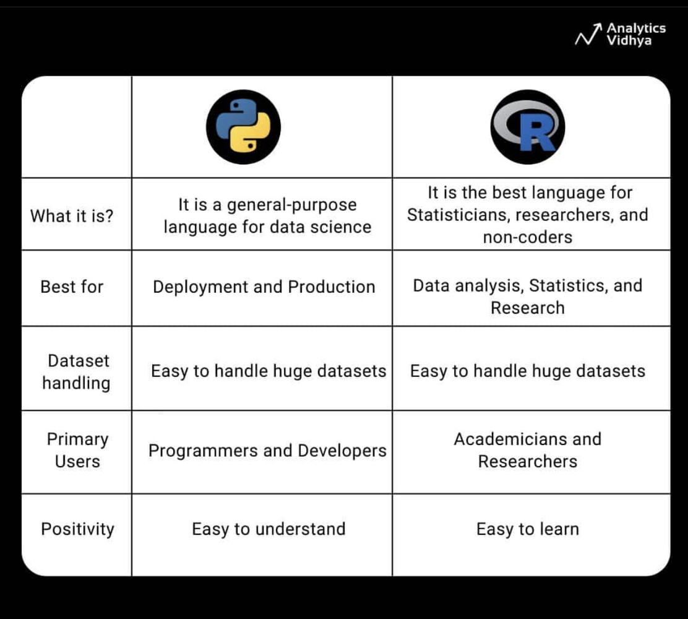

# Python para Ciencia de Datos

En este repo se encontrarán todos los materiales que se utilizaron para desarrollar el curso Python para Ciencia de Datos, dictado entre el 15 y 27 de setiembre de 2024. 

## Por qué usar Python para Ciencia de Datos?

Quien esté en el mundo de los datos hace un tiempo, sabe bien que discutir sobre ciencia de datos es en parte discutir sobre R y Python, y cuál es el lenguaje más adecuado para llevar adelante las tareas de la disciplina. Como introducción a este curso, se discutirá sobre esta rivalidad y qué implica conocer uno u otro lenguaje.

### ¿De qué hablamos cuando nos referimos a R y Python?

Como bien lo describe su página web, R es un lenguaje desarrollado para análisis matemático-estadístico. En 1995 evoluciona de su antecesor, el lenguaje de programación S, y comienza su expansión por el mundo académico, la cual hoy complementa con la ciencia de datos. Por otro lado, Python fue liberado al mundo en 1991, con el objetivo de ser un lenguaje de programación más orientado al desarrollo de software, con la características de ser muy ameno al entendimiento y de sintaxis simple. 

### ¿Y cuál es el mejor para ciencia de datos?

A continuación se presenta un cuadro elaborado por [Analytics Vidhya](https://www.analyticsvidhya.com/), una comunidad virtual que se encarga de difundir, debatir y capacitar sobre Machine Learning y Data Science, en donde se detallan las diferencias entre cada lenguaje. Parece que, a juicio de la comunidad, Python es un lenguaje más orientado el desarrollo y producción de soluciones, mientras que R tiene más sentido a nivel de análisis estadístico. Ambos tienen gran capacidad para manipular grandes datasets, y son sencillos de entender y aprender. Naturalmente, quienes usan más Python parecen ser los que están más vinculados con la tecnología, mientras que R tiene más impacto en sectores académicos e investigadores.

También utilizan herramientas diferentes para sus aplicaciones. Quienes desarrollan en Python, suelen hacerlo en los IDE (Integrated Development Environment) Jupyter Notebook o Spyder, mientras que R tiene un IDE de referencia denominado R-Studio (que por cierto, también permite utilizar Python). A su vez, estos lenguajes tienen ciertos paquetes o librerías de referencia. Por el lado de Python, es común escuchar a los científicos de datos hablar de Pandas para manipular datasets, Numpy para análisis estadísticos, Matplotlib para visualizaciones y el famoso Scikit-learn para todo lo referido a Machine Learning. Por el otro lado, en R los paquetes más famosos son: dplyr para manipulación de datos, ggplot2 para visualizaciones, y Shiny para el desarrollo de dashboards interactivos.

Si se sigue utilizando el análisis de Analytics Vidhya, se pueden encontrar las especialidades de cada uno. Parecería que R tiene mayores credenciales en lo que refiere a la visualización de datos, manejo de series temporales, y una mayor simplicidad para realizar análisis estadísticos que a priori serían complejos. Por otra parte, Python es más conveniente para desarrollo de aplicaciones más robustas, en la medida que es un lenguaje de programación más amplio y no específico para ciencia de datos, junto con mayores facilidades para realizar procesos de lenguaje natural (NLP), y una mayor simplicidad para generar instancias colaborativas entre equipos de trabajo.

El CEO de [Anaconda Inc.](https://www.anaconda.com/), Peter Wang, [compartió en 2021](https://x.com/pwang/status/1418246487440601088) los resultados de un [estudio](https://www.anaconda.com/resources/whitepapers/state-of-data-science-2021) que la empresa realizó sobre el estado del arte de la ciencia de datos. Entre estos resultados, se percibe a Python como el lenguaje que más suele utilizarse por los científicos de datos encuestados. La [última edición](https://know.anaconda.com/rs/387-XNW-688/images/Anaconda%202023%20State%20of%20Data%20Science%20Report.pdf?mkt_tok=Mzg3LVhOVy02ODgAAAGTFsuq1Ko053LSQNW3j11LbN6MPLPQHik8O5_huA8SJ0buhkEjZrFSHmoGu3XL8m8-LYxd_W0ohsZqOkI6ex22io3qfhmS-FFRck8sijrosXVM) de este estudio, hecha en 2023, ni siquiera actualiza esta discusión. Python es definitivamente el lenguaje de programación instalado para la ciencia de datos.

Finalmente, las empresas dedicadas enteramente a R como RStudio, han mutado a servicios más genéricos. En el caso de RStudio, ahora se denomina POSIT, y está enfocado en servicios en la nube para ciencia de datos, en donde se puede utilizar tanto R como Python. Esto muestra una clara tendencia hacia Python en términos de tamaño de comunidad y mercado.

## Integración con Ingeniería de Datos

La Ciencia de Datos cada vez tiene menos sentido sin una integración real a sistemas en producción que automaticen una determinada tarea o indicador. Es por esto que cada vez más la Ciencia de Datos se vincula con la Ingeniería de Datos y el MLOps. Estas dos disciplinas son las encargadas de mover y preparar los datos que entrenan o consultan los modelos predictivos que la Ciencia de Datos desarrolla. Y este mundo está construido enteramente con Python.